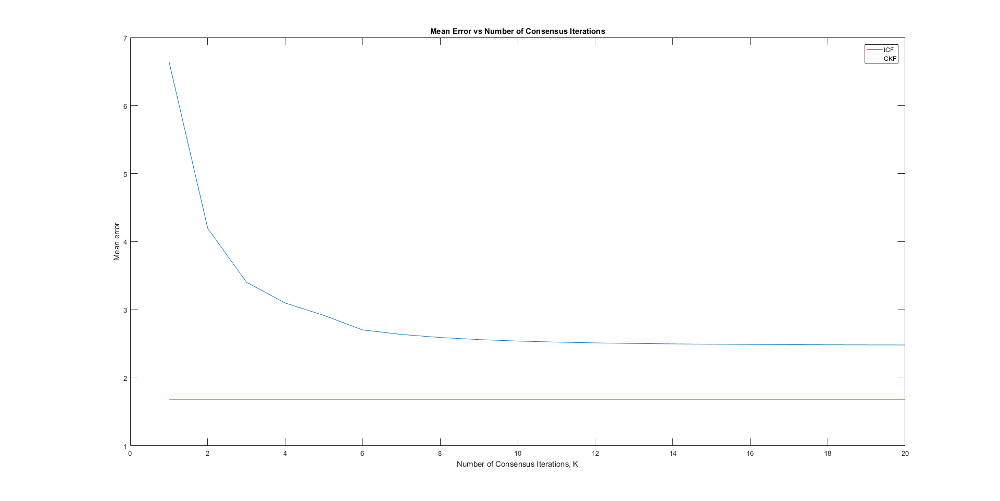

# Information-Weighted-Consensus
Implementation of Informaiton Weighted Consensus using MATLAB
According to [this paper](http://citeseerx.ist.psu.edu/viewdoc/download?doi=10.1.1.310.4837&rep=rep1&type=pdf) _(Information Weighted Consensus)_

## Abstract
Information weighted consesus (ICF) is a distributed version of Kalman Filter. By distributed, it means that there are multiple nodes in a system, each having a limited observability of the target it is trying to track. Information is passed through nodes for the state update and information update of each node to arrive at a consensus between nodes.

## Implementation
### Tracking of a moving object in a 500x500 space

Green: Ground truth trace of moving object
Red: ICF
Black: Central Kalman Filter (CKF)

### Error vs Different Simulation Runs

### Error vs Consensus Iterations

